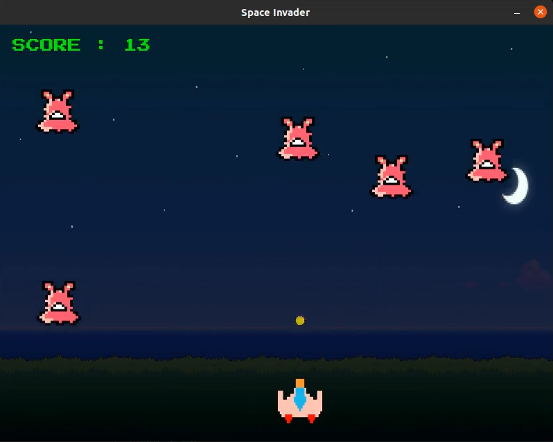

# **Space Invaders**

***Copy of Space Invaders tried using Pygame. A arcade style game where player have to shoot aliens which are attacking on our planet before they touch the ground. 
 Player can play this game endless and keep increasing the score.***
 
 

## **Game Mechanism** :
Bullet are drawn infinitly on the screen. When the bullet is fired it's postion at y-axis decreases which feels like bullet is fired and moving forward.
 Player can shoot one bullet at a time unill it reaches the 0th position at y-axis, it gets reset to the orginial position at y-axis from where it was shoot  and x-axis where player is located. 
 This reseting of bullet works same when it hits any enemy.
 Enemies are drawn randomly at the starting of the game and when a bullets hit them. 
 

## **Programming Languages and Modules** :
**Python** : This game is purely made in Python Programming Language. 
**Pygame**: Pygame is a module provided by Python to create games in Python Programming Language. (Link to Official Documentation is given below in Resources and References section). 
 
 

## **Keyboard keys for Player movement** :  
<kbd>A</kbd> is used for moving player to the Left. 
<kbd>D</kbd> is used for moving player to the Right.

## **Mouse key for firing bullet** :  
<kbd>Left Mouse Key</kbd> is used for Firing Bullets at enemy. 
 

## **Resources and References** :  
* **FreeCodeCamp Youtube Channel** - [Pygame Tutorial](https://www.youtube.com/watch?v=FfWpgLFMI7w). 
* **Pygame Official Website** - [Pygame Documentation](https://www.pygame.org/docs/). 
* **Make8bitart Official Website** - [8-bit Image making Tool](https://make8bitart.com/). 
* **Flaticon Official Website** - [Free Images and Icons](https://www.flaticon.com/). 
* **Google Fonts** - [Press Start 2P font by CodeMan38](https://fonts.google.com/specimen/Press+Start+2P). 
* **Reduceimages Official Website** - [Image size converter in Pixels and Percentage](https://www.reduceimages.com/).